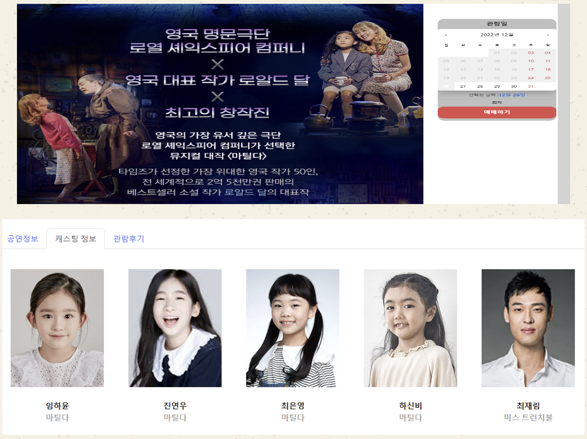

# FinalProject

<p align="center">

</p>  

<div align="center">

[](https://hits.seeyoufarm.com)

</div>

## 01. TCat

> 학원 파이널 프로젝트
>
> 개발 기간 : 2022.11 ~ 2023.01

<br>

### 배포 주소

> http://www.tcats.site

<br>

### 개발팀 소개

|                              백엔드                               |                             백엔드                              |                           프론트엔드                            |                             프론트엔드                              |                             프론트엔드                              |
|:--------------------------------------------------------------:|:------------------------------------------------------------:|:----------------------------------------------------------:|:--------------------------------------------------------------:|:--------------------------------------------------------------:|
|  |  |  |  |  |
|            [GomDiing](https://github.com/GomDiing)             |            [hjm8727](https://github.com/hjm8727)             |             [hrhr7](https://github.com/hrhr7)              |           [jimin0601](https://github.com/jimin0601)            |            [Ryel1580](https://github.com/Ryel1580)             |  

<br>

### 프로젝트 소개

다양한 카테고리에 나와있는 상품에 대한 포스터 등 정보 제공과 간편 결제를 활용한 예매 시스템 기능을 지원하는 [인터파크](https://www.interpark.com/)에서 아이디어를 착안했습니다.

프론트엔드는 React, 백엔드는 Spring, 크롤링은 Python, 간편 결제 기능은 카카오페이, 소셜로그인은 구글과 카카오를 사용했습니다.

<br>

## 02. 시작 가이드

> [!CAUTION]
> 보안 문제로 Backend & Frontend & Python 설정 파일을 업로드하지 않았습니다.  
> 제대로 작동하지 않으니 [배포 주소](#배포-주소)로 접속해주세요.

<br>

### 요구 Library

---

#### Python

> - selenium==4.25.0
>- webdriver-manager==4.0.2
>- beautifulsoup4==4.12.3
>- requests==2.32.3
>- SQLAlchemy==2.0.35
>- mysql-connector-python==9.0.0
>- python-dotenv==1.0.1
>- urllib3==1.26.15
>- certifi==2024.8.30
>- charset-normalizer==3.4.0

#### Spring

다음 Library를 요구합니다.
> - Spring Web
>- Spring Data JPA
>- Validation
>- Lombok
>- MySQL Driver

<br>

#### React

해당 프로젝트의 React는 다음 Library를 요구합니다.
> - antd
>- axios
>- bootstrap
>- firebase
>- moment
>- react
>- react-bootstrap
>- react-calendar
>- react-daum-postcode
>- react-dom
>- react-horizontal-scrolling
>- react-icons
>- react-redux
>- react-router-dom
>- react-scripts
>- react-uuid
>- recharts
>- redux-persist
>- styled-component
>- styled-components
>- web-vitals

<br>

### 설치

---

```
$ git clone https://github.com/GomDiing/Kh_FinalProject.git  
$ cd Kh_FinalProject
```

#### Backend

```
$ ./gradlew build
$ cd build/libs
$ java -jar demo-0.0.1-SNAPSHOT.jar
```

#### Frontend

```
$ cd src/main/frontend
$ npm install
$ yarn start
```

#### Python

````
$ cd crawling
$ pip3 install requirements.txt 
$ python main.py
````

<br>

## 03. 기술 스택

<h3 align="left"> Tools </h3>
<div align="left">
&nbsp
&nbsp
&nbsp
&nbsp
&nbsp
&nbsp
</div>

<h3 align="left"> Frontend </h3>
<div align="left">
&nbsp
&nbsp
&nbsp
&nbsp
&nbsp
</div>

<h3 align="left"> Backend </h3>
<div align="left">
&nbsp
&nbsp
&nbsp
&nbsp
&nbsp
&nbsp
</div>

<h3 align="left"> Deploy </h3>
<div align="left">
&nbsp
&nbsp
</div>

<br>

## 04. 화면 구성

|                            로그인 페이지 (일반)                             |                               로그인 페이지 (소셜)                               |
|:-------------------------------------------------------------------:|:------------------------------------------------------------------------:|
|      |           |
|                             아이디/비밀번호 찾기                             |                                  회원 가입                                   |
|         |                 |
|                               마이 페이지                                |                            마이 페이지 - 예매/취소 내역                             |
|            |  |
|                          마이 페이지 - QnA 문의하기                          |                             마이 페이지 - 회원정보수정                              |
|        |    |
|                            마이 페이지 - 찜목록                             |                                 검색 - 작품명                                 |
|      |            |
|                           마이 페이지 - 카테고리별                            |                                 상세페이지 1                                  |
|  |                 |
|                               상세페이지 2                               |                                  리뷰 작성                                   |
|           |           |
|                                댓글 작성                                |                                   예매하기                                   |
|    |                |
|                                결제하기                                 |                                   예매취소                                   |
|               |         |

<br>                                         

## 05. API 문서 주소

> [!NOTE]
> API 문서는 [해당 링크](https://telling-list-c32.notion.site/API-14302fd0ff7c44709f3a5dac9ef18849?pvs=4)에서 자세히 보실 수 있습니다.

|                            API 목차                             |                            API 상세                            |
|:-------------------------------------------------------------:|:------------------------------------------------------------:|
|      |  |
|                           API 요구사항                            |
|  |

<br>

## 06. 주요 기능

1. 인기 공연 정보 제공
    - 주간 / 일간 두 분류로 구분
2. 일반 로그인 뿐만 아니라 소셜 로그인 기능도 제공
    - 사용한 로그인 API는 카카오, 구글
3. 간편 결제 시스템 도입
    - 개발버전으로 카카오페이 API 사용
4. 웹 정보 파싱
    - Selenium 사용하여 웹 정보 파싱

<br>

## 07. 아키텍쳐

<div align="center">

</div>

```
.
├── crawling            //Python Selenium 크롤링 소스코드
├── md_attachment       //README 첨부파일
└── src                 //Spring-React 소스코드
    └── main
        ├── frontend          //React 소스코드
        │   ├── public           //Image 파일
        │   │   └── images
        │   └── src
        │       ├── api             //API 모음
        │       ├── components         //컴포넌트 모음
        │       │   ├── KakaoPay       //카카오페이
        │       │   └── views          //View 모음
        │       │       ├── AdminPage                 //관리자 페이지
        │       │       │   ├── Dashboard                //대시보드
        │       │       │   │   ├── chart
        │       │       │   │   ├── featuredInfo
        │       │       │   │   ├── profile
        │       │       │   │   └── recentComment
        │       │       │   ├── Inquiry                  //문의
        │       │       │   ├── Notice                   //공지사항
        │       │       │   └── Tool                     //Firebase, 상단바
        │       │       ├── Cards                     //찜목록, 배우 페이지
        │       │       ├── DetailPage                //상세 페이지
        │       │       │   └── Section
        │       │       │       ├── Body
        │       │       │       ├── Popup
        │       │       │       ├── Side
        │       │       │       └── Summary
        │       │       ├── Footer                    //Footer
        │       │       ├── LoginPage                 //로그인
        │       │       ├── MainHeader                //메인헤더(검색)
        │       │       │   └── Search
        │       │       ├── MainPage                  //메인화면 페이지
        │       │       │   └── Content
        │       │       │       ├── MainBanner        //메인 배너
        │       │       │       ├── MainIcon
        │       │       │       │   └── IconModal
        │       │       │       │       └── ModalBody    //예매 모달
        │       │       │       ├── MainNotice        //메인 공지사항
        │       │       │       ├── MainPoster        //메인 포스터
        │       │       │       ├── MainRankingArea   //주간/월간 랭킹
        │       │       │       └── MainReview        //메인 후기
        │       │       ├── MyPage                    //마이페이지
        │       │       │   └── section
        │       │       │       └── Iquiry               //문의
        │       │       └── SignPage                  //회원가입 페이지
        │       ├── images
        │       └── util
        │           ├── Modal
        │           └── Redux
        └── java/com/kh/finalproject      //Spring 소스코드
               ├── common                    //BaseEntity
               ├── config                    //WebConfig
               ├── controller                //Controller 모음
               ├── dto                       //DTO 모음
               │   ├── accuse                   //신고
               │   ├── casting                  //캐스팅(배우)
               │   ├── chart                    //차트
               │   ├── member                   //회원
               │   ├── notice                   //공지
               │   ├── product                  //상품
               │   ├── qna                      //질문
               │   ├── ranking                  //인기순위(랭킹)
               │   ├── reserve                  //예매
               │   ├── reserveTimeSeatPrice     //예매시간별 좌석/가격
               │   ├── reservetime              //예매시간
               │   ├── reviewComment            //후기 댓글
               │   ├── reviewLike               //후기 좋아요
               │   ├── seatPrice                //좌석 가격
               │   ├── statistics               //분석
               │   └── wishProduct              //찜목록
               ├── entity                    //Entity 모음
               │   └── enumurate
               ├── exception                 //예외
               ├── repository                //Repository 모음
               ├── response                  //응답(Frontend) 모음
               ├── service                   //Service 모음
               │   └── impl                     //Service 구현체
               └── social                    //소셜 관련
                  ├── google                    //구글
                  └── kakao                     //카카오
                     ├── login                     //카카오 로그인
                     └── pay                       //카카오페이
```

<br>

## 08. 개발 문서

### ER 다이어그램

<div align="center">

</div>

### 클래스 다이어그램

<div align="center">

</div>

## 09. 트러블슈팅 & 해결

### 이슈1. 공통 응답 및 예외처리 필요성

---

배경 및 원인

- 응답 코드와 API문서를 작성 중 규모가 커지면서 기존 방식으론 모든 응답을 만들어 처리하는데 한계를 느꼈습니다.
- 특히 상세 페이지 등 응답해야할 데이터가 많아질수록 일관된 처리 필요성을 느꼈습니다.

해결 방법

- Spring의 Exception 처리하는 과정을 알게되고 그 방법에는 크게 `@ExceptionHandler`와 `@ControllerAdvice` 두 방식이 있고 `@ControllerAdvice` 방식을
  적용해 공통 예외 처리를 다뤘습니다.

- 관련 코드 또는 사진
    - 예시) 회원 조회 컨트롤러 의사코드

    ```java
    // 전체 조회 조회 Controller
    @GetMapping("/api/member/memberlist")
    public ResponseEntity<DefaultResponse<응답_DTO>> 전체_회원_조회(요청_DTO){
    		응답_DTO = Service_회원.Method_전체회원조회(요청_DTO);
        return new ResponseEntity<>(DefaultResponse.res(응답_메시지, 응답_DTO), HttpStatus.OK);
    }
    ```

    - DefaultResponse - 공통 응답

    ```java
    public class DefaultResponse<T> {
        private String 메시지;
        private T 응답;
        
        // @Builder 작성
        
        public static<T> DefaultResponse<T> res(String message, final T t) {
            return DefaultResponse.<T>builder()
                    .응답(t)
                    .메시지(message)
                    .build();
        }
    }
    ```

    - ExceptionControllerAdvice - 공통 예외처리

    ```java
    @RestControllerAdvice
    public class ExceptionControllerAdvice {
        /**
         * @Valid로 binding error 발생시
         */
        @ExceptionHandler(MethodArgumentNotValidException.class)
        public ResponseEntity<DefaultErrorResponse> handleMethodArgumentNotValidException(MethodArgumentNotValidException e) {
            DefaultErrorResponse defaultErrorResponse = DefaultErrorResponse.of(에러_메시지, e.getBindingResult());
    
            return new ResponseEntity<>(defaultErrorResponse, HttpStatus.BAD_REQUEST);
        }
    }
    ```

### 이슈2. HTTPS 적용

---

배경 및 원인

- HTTPS 프로토콜 적용을 위해 ACM의 인증서를 받아 적용하려했으나, 기존 구조에선 SSL/TLS 인증서 적용하기 어려웠습니다.

해결 방법

- EC2 직접 설치, Route 53 연결, 로드밸런서 적용 방법 중 로드밸런서에 적용하기로 했고, 실 프로덕션 환경 및 ALB 고가용성을 위해 두 개 AZ에 EC2를 배포하기로 했습니다.

- 관련 코드 또는 사진

<div align="center">

</div>


## 이슈3. 예상치못한 예외 발생

---

배경 및 원인

- 상세페이지 접근시 호출하는 금일 예매 정보 JPA, 만약 해당 정보가 없다면 만든 에러를 발생할거라 생각했지만 못했고 `IndexOutOfBoundsException`이 발생했습니다.

해결 방법

- 해당 JPA 메서드 (`findAllByProductAndTimeBetween`)이 빈 리스트(`Empty list`)를 반환하더라도 `orElseThrow()`는 `Optional.empty()`인 경우에만 예외를 발생시킨다는걸 알았습니다.
- `filter`를 통해 `list`가 비어있으면 `Optional.empty()`로 처리하여 예상된 예외를 발생시키도록 했습니다.

- 관련 코드 또는 사진

    ```java
    // 이전 코드
    List<ReserveTime> findReserveTimeWithinDay = reserveTimeRepository
    		.findAllByProductAndTimeBetween(findProduct, firstPotionOfDay, lastPositionOfDay)    
        .orElseThrow(() -> new CustomException(CustomErrorCode.EMPTY_RESERVE_TIME));
            
    // 수정 코드
    List<ReserveTime> findReserveTimeWithinDay = reserveTimeRepository
        .findAllByProductAndTimeBetween(findProduct, firstPotionOfDay, lastPositionOfDay)
        .filter(list -> !list.isEmpty())
        .orElseThrow(() -> new CustomException(CustomErrorCode.EMPTY_RESERVE_TIME));
    ```


알게 된 점

- AWS 배포방법, VPC, EC2 등 AWS 웹 배포 구조를 알았습니다.
- AWS 환경에서 SSL/TLS 인증서 적용방법에대해 알게되었습니다.

## 기타

### IntelliJ 설정

1. `Preference` 설정
    - Annotation Processor 활성화 (롬북 활성화)

        - `annotation processor` 검색 후 체크박스 활성화
          <br>

    - File Encoding 변경
        - `file encoding` 검색 후 <br>`Default encoding for properties files` 변경
          <br>

    - Gradle 환경 변경 (IntelliJ가 더 빠르다)
        - `Build and run using`, `Run tests using`을<br>`Gradle` -> `IntelliJ IDEA`로 변경<br><br>
          <br>
2. `gitignore` 설정

    - 아래 문구 추가 (설정 파일 제외 (*.properties, *.yml))

      `**/src/main/resources/*.properties`
      `**/src/main/resources/*.yml`

<br>

### SpringBootStarter 설정

---

1. [스프링 부트 스타터 홈페이지 이동](https://start.spring.io/)
2. 아래와 같이 설정
   

```html
Project: Gradle-Groovy

Language: Java

Spring Boot: 2.7.6 (없다면 2.x.x 버전 중 선택)

Project Metadata
Group: com.kh
Artifact: final-project
Name: final-project
Description: Spring Boot for Kh Final Project
Package name: com.kh.final-project
Packaging: Jar
Java: 11

Dependencies:
Spring Web
Spring Data JPA
Thymeleaf
Validation
Lombok
MySQL Driver
H2 Database
```